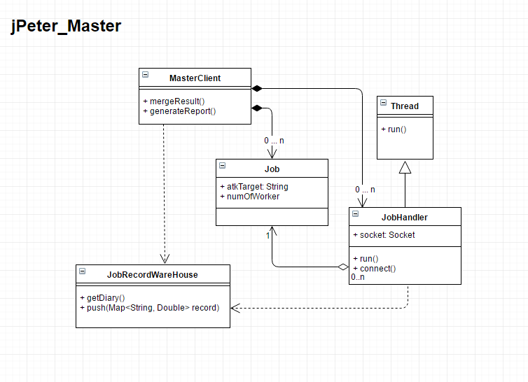
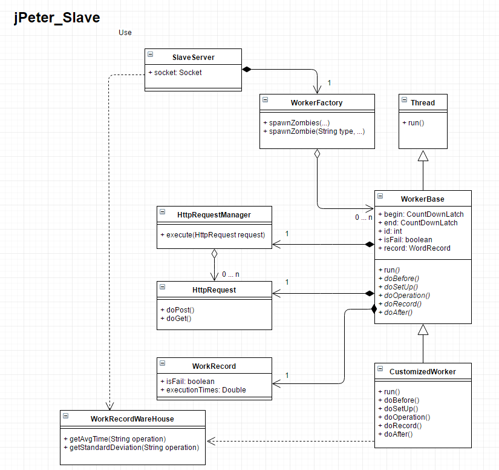
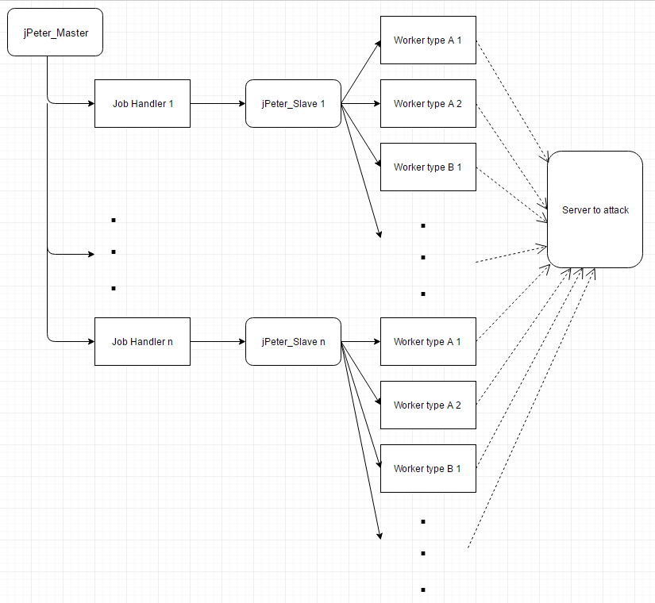
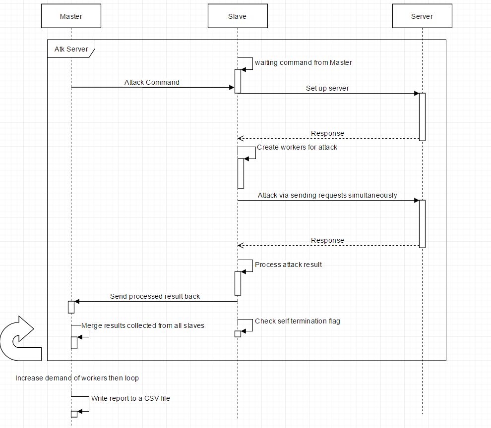

jPeter - Performance Test Tool
=========================================================

## Intro:
* jPeter is a performance test tool which spawns worker threads to perform customized jobs and records target's respond times.
* It comes with CLI which allows execution without installing an IDE.
* Master-Slave structure is used for distributing jobs onto multiple machines with ease. 

## Environment set up: Java 7+, Linux based OS
* Java: SDK-7 is recommended. Bear you own risk is any other version is used.
To install, please refer to: http://www.wikihow.com/Install-Oracle-Java-on-Ubuntu-Linux

## Run the test:
There are two ways to run the test; via CLI or an IDE.
Either way, there are some works to do before it can be used.

1. For the slave, implement the jobs to perform by inheriting CountDownWorkerBase, a template class.
2. For the slave, modify the types of worker to spawn in the WorkerFactory.
3. For the slave, define the constant strings according to the worker types implemented in WorkerTypeDefinition.
4. For the slave and the master, modify the constant strings in RespondTimeDefinition according to the jobs implemented and the info that will be shipped.
5. Contact Peter if you have done everything above, but it's not working.

* CLI:
For the help meun pass -h.

```bash
java -jar jPeter_Slave.jar -h
java -jar jPeter_Master.jar -h
```

To run a slave pass --p for port number used for communicating with master, port 8887 is used if no argument is passed.
```bash
java -jar jPeter_Slave.jar -p=8888
```

To run a master pass -t for test target, -s for slaves' IP & port, -r for number of reruns, -e for number of workers to end the test,
and -w for the ratio of works to spawn, this must match the number of types of worker defined in the WorkerTypeDefinition on the slave side.
```bash
java -jar jPeter_Master.jar -t=myTargetServerUnderTest.com -s=localhost:8887,localhost:8888,127.2.3.4:8887 -r=1 -e=500 -w=-1:3:2
```

* IDE:
Similar to running them with CLI, just pass the arguments to them and execute.

## How to inspect test result:
After the test runs to completion, a CSV report will be generated in a result folder.
If it's run with CLI, it will be in the same directory the jPeter_Master.jar is located, and
if it's executed via an IDE, the report will be placed in the result folder in the project directory.

## UML Diagrams
*jPeter_Master_Class_Diagram


*jPeter_Slave_Class_Diagram


*Relation_Diagram


*Sequence_Diagram


